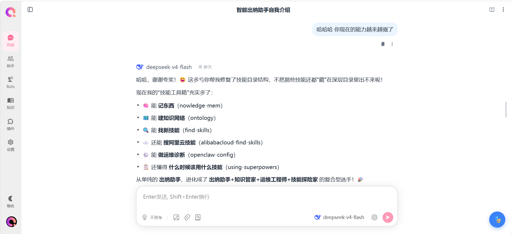
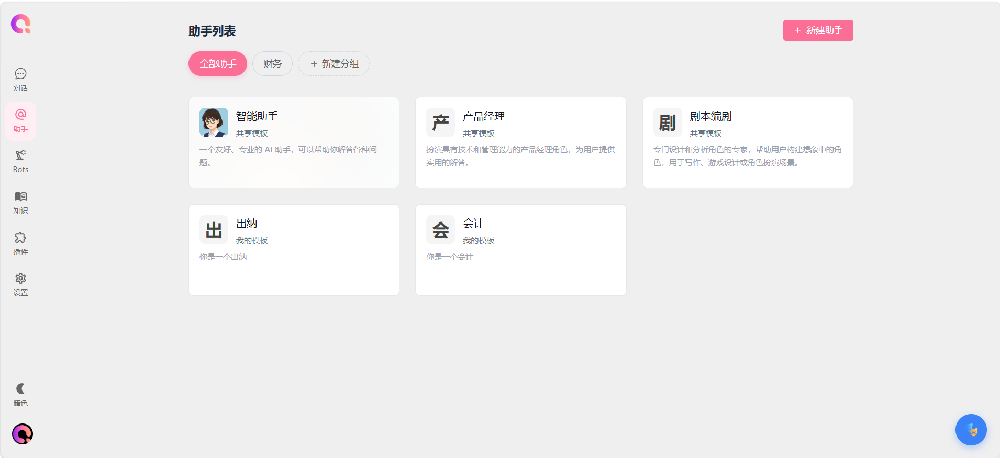
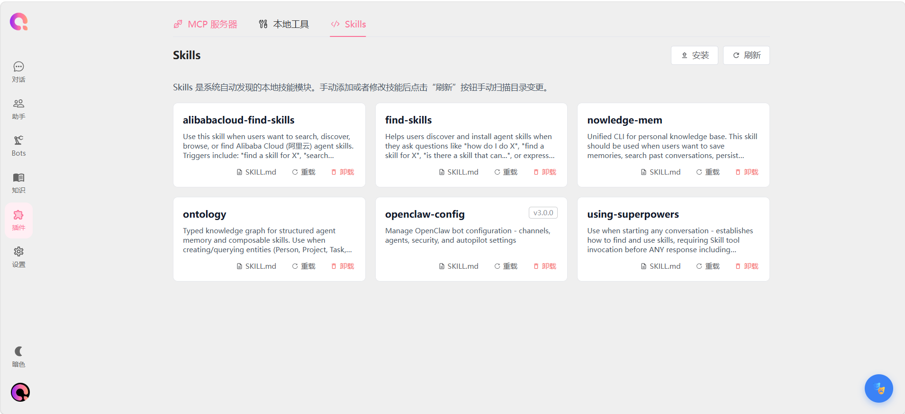
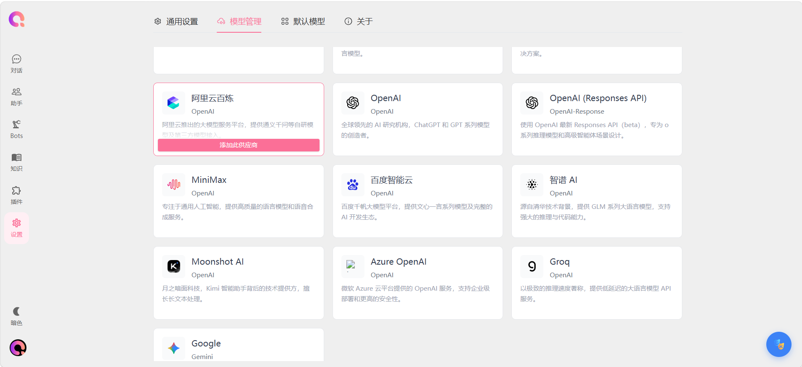

<div align="center">

#  GuadaClaw

> 智能 AI 对话系统，支持 ReAct Agent、多模型适配、RAG 知识库检索、MCP 工具调用与 Skills 技能框架

[](LICENSE)
[](https://github.com/andoaidlaksldk/GuadaClaw)
[](https://github.com/andoaidlaksldk/GuadaClaw/commits/main)
[](https://github.com/andoaidlaksldk/GuadaClaw/stargazers)

</div>

---

## 📋 目录

- [简介](#简介)
- [功能展示](#功能展示)
- [核心功能](#核心功能)
- [技术栈](#技术栈)
- [快速开始](#快速开始)
- [项目结构](#项目结构)
- [许可证](#许可证)

---

## 🌟 简介

GuadaClaw 是一个功能完备的 AI 对话和工作辅助平台，致力于打造可用、易用、好用的个人智能助理。

**核心价值**：
- 🤖 **智能对话**：基于 ReAct 模式的多轮自治对话引擎
- 📚 **知识检索**：完整的 RAG 知识库检索系统
- 🛠️ **工具调用**：支持 MCP 协议和自定义技能框架
- 🌐 **多端支持**：Web、Electron 桌面、IM 平台多端适配

---

## 🖼️ 功能展示

### 系统架构


### 对话界面



### 助手面板



### 技能管理



### 模型设置



---

## ✨ 核心功能

| 功能模块 | 描述 | 图标 |
|---------|------|------|
| **Agent 对话引擎** | ReAct 模式多轮自治循环，支持流式输出和中断处理 | 🤖 |
| **知识库 RAG** | 语义搜索 + 关键词搜索混合检索，支持 40+ 文件格式 | 📚 |
| **MCP 工具调用** | 标准 MCP 协议支持，可扩展外部工具 | 🔧 |
| **Skills 技能框架** | 基于 Anthropic Skills 协议，支持热插拔 | ⚡ |
| **Bot 网关** | 多平台即时通讯适配（QQ/飞书/企业微信） | 💬 |
| **浏览器自动化** | Electron 内嵌浏览器引擎，支持页面交互 | 🌐 |

### 🤖 Agent 对话引擎

实现 **ReAct (Reasoning + Acting)** 模式：

- **会话锁机制**：同一会话同时仅处理一个请求，防止并发冲突
- **流式传输**：SSE 异步实时渲染，前端即时响应
- **中断处理**：客户端断开自动中止，有效节省 Token 成本
- **思考追踪**：记录推理耗时和思维链，便于调试和优化

### 📚 知识库系统

完整的检索增强生成流程：

- **自助多轮搜索**：Agent 自主决定搜索策略和轮次
- **混合检索**：语义搜索（sqlite-vec）+ 关键词搜索（FTS5）加权融合
- **智能分块**：基于 Token 的智能分块策略，支持句子边界切割

### ⚡ Skills 技能框架

基于 **Anthropic Skills 协议** 设计：

- **热插拔**：文件系统存储，支持动态加载和更新
- **渐进式披露**：L1/L2 分级指令注入，按需激活工具集
- **版本管理**：语义化版本控制 + SHA256 哈希变更检测

---

## 🛠️ 技术栈

### 后端技术

<table width="100%">
<tr>
<th width="25%">技术</th>
<th width="15%">版本</th>
<th width="60%">用途</th>
</tr>
<tr>
<td>NestJS</td>
<td>11.x</td>
<td>企业级 Node.js 框架</td>
</tr>
<tr>
<td>TypeScript</td>
<td>6.x</td>
<td>类型安全开发</td>
</tr>
<tr>
<td>Prisma</td>
<td>7.x</td>
<td>现代 ORM</td>
</tr>
<tr>
<td>SQLite</td>
<td>3.x</td>
<td>轻量级数据库</td>
</tr>
<tr>
<td>sqlite-vec</td>
<td>-</td>
<td>向量数据库扩展</td>
</tr>
</table>

### 前端技术

<table width="100%">
<tr>
<th width="25%">技术</th>
<th width="15%">版本</th>
<th width="60%">用途</th>
</tr>
<tr>
<td>Vue 3</td>
<td>3.4+</td>
<td>渐进式 JavaScript 框架</td>
</tr>
<tr>
<td>Vite</td>
<td>6.x</td>
<td>下一代前端构建工具</td>
</tr>
<tr>
<td>Element Plus</td>
<td>2.x</td>
<td>Vue 3 组件库</td>
</tr>
<tr>
<td>Pinia</td>
<td>2.x</td>
<td>Vue 状态管理</td>
</tr>
</table>

### 桌面技术

<table width="100%">
<tr>
<th width="25%">技术</th>
<th width="15%">版本</th>
<th width="60%">用途</th>
</tr>
<tr>
<td>Electron</td>
<td>31.x</td>
<td>跨平台桌面应用框架</td>
</tr>
</table>

---

## 🚀 快速开始

### 环境要求

- **Node.js**: ≥ 18.x（推荐 20.x LTS）
- **npm**: ≥ 9.x

### 启动后端

```bash
cd backend-ts
npm install              # 安装依赖
npm run db:seed:force    # 初始化种子数据（默认账户：admin / admin）
npm run start:dev        # 开发模式启动 → http://localhost:3000
```

### 启动前端

```bash
cd frontend
npm install              # 安装依赖
npm run dev              # 开发模式启动 → http://localhost:5173
```

### 部署文档

- 📖 [生产环境部署指南](docs/PRODUCTION_DEPLOYMENT.md)
- 📦 [Electron 打包部署](docs/ELECTRON_DEPLOYMENT.md)
- 🔍 [故障排查指南](docs/TROUBLESHOOTING.md)

---

## 📁 项目结构

```
GuadaClaw/
├── backend-ts/          # NestJS 后端服务
│   ├── prisma/          # Prisma Schema 和迁移
│   ├── src/
│   │   ├── common/      # 基础设施模块
│   │   │   ├── database/    # 数据库连接
│   │   │   ├── vector-db/   # 向量数据库
│   │   │   └── mcp/         # MCP 客户端
│   │   └── modules/     # 业务模块
│   │       ├── chat/        # 核心对话引擎
│   │       ├── tools/       # 工具调用系统
│   │       ├── skills/      # Skills 技能框架
│   │       ├── knowledge-base/  # RAG 知识库
│   │       └── bot-gateway/     # 多平台机器人网关
│   └── skills/          # Skills 技能目录
├── frontend/            # Vue 3 前端应用
│   └── src/
│       ├── components/  # UI 组件
│       ├── composables/ # Vue 组合式函数
│       ├── stores/      # Pinia 状态管理
│       └── services/    # API 服务层
├── build-resources/     # Electron 构建资源
├── docs/                # 项目文档
└── scripts/             # 辅助脚本
```

---

## 📄 许可证

本项目基于 **MIT License** 开源，详见 [LICENSE](LICENSE)。

---

<div align="center">

**Made with ❤️ by GuadaClaw Team**

[](https://nestjs.com)
[](https://vuejs.org)
[](https://www.typescriptlang.org)
[](https://www.electronjs.org)

</div>